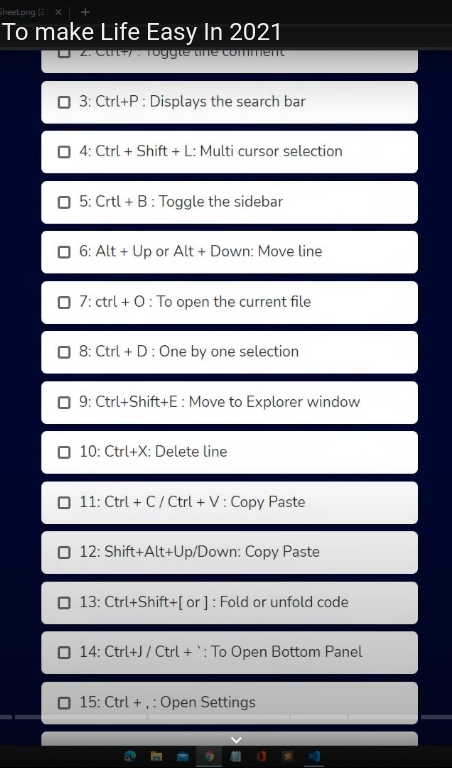
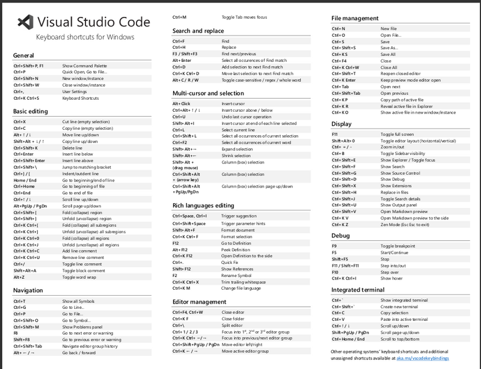

|  |
| --------------------------------------------------------------- |

|  |
| --------------------------------------------------------------- |


```

1.Trigger suggestion
CTRL + SPACE
This one will trigger the suggestion window to appear again if you accidently get into a situation where it's lost ⚡ 


2. Search
CTRL + P
Display the search bar

3. Go to line
CTRL + G
Allows you to jump directly to a line by using the line number. This saves me time when colleagues give me a line number 🔢

4. Move line up/down
ALT + DOWN/UP
I think most people know this one. You can use it to move a line up or down ⬆

5. Copy line up/down
SHIFT + ALT + DOWN/UP
Similar to the last one, but this will copy a line up or down 🖨

6. Remove current line
CTRL + SHIFT + K
I struggle to get used to using this one, but as the name suggests, it will delete the current line ❌

7 . Go to symbol
CTRL + O
Opens up a list of symbols in the current file. This especially comes in handy when you have a large class and need to jump to a particular method 🦘


8. Trigger parameter hints
CTRL + SHIFT + SPACE
Similar to the last one, but this one will trigger parameter hints for a method of function if you lose them. Definitely helpful for long parameter lists! 📈

9. Reveal in file explorer
CTRL + K, R
Reveals the active document in the file explorer. Before I knew about this, I used to right-click the side bar and reveal the file from there 😔

10. Select all occurrences of current selection
CTRL + SHIFT + L
Lastly, this one will select all occurrences of the current/active selection. Very useful for file-wide replacements 📑

11: Toggle the comments
CTRL +  / 
You, can comment any lines of code by simply using this shortcuts.

12:  To delete the line
CTRL + X
With this you can delete any single line of code 

13: Fold and unFold code 
CTRL + J / CTRL + `  
It very handy shortcut to make our code look clean and neat by folding the groups of part. 


For a full list of VS Code shortcuts, check out their Keyboard reference sheets https://code.visualstudio.com/shortcuts/keyboard-shortcuts-windows.pdf

```
